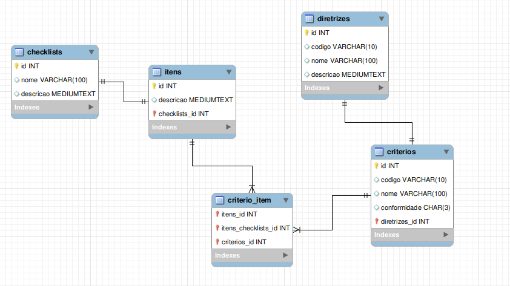

<h1 align="center" > Ferramenta AcessaWEB <h1>

<p align="center">

</p>

### Sumario

* [Como rodar o projeto localmente](#-como-rodar-o-projeto-localmente)
* [Entendendo o projeto](#books-entendendo-o-projeto)
* [Como realizar os testes atraves do Cypress](#como-realizar-os-testes-atraves-do-cypress)

# 💻 Como rodar o projeto localmente
---
## Instalando Requisitos
O projeto foi realizado utilizando Laravel e MySQL, portanto é necessário baixar e instalar requisitos os requisitos necessários.

- MySQL (https://www.mysql.com/products/community/)
- PHP (https://www.php.net/manual/en/install.php)
- Composer (https://getcomposer.org/doc/00-intro.md)
- Node.js (https://nodejs.org/en/download)


**Para Windows**, é recomendado realizar a instalação do XAMPP, que é um facilitador do processo de instalação. Ele já instala o MySQL e o PHP(com as bibliotecas necessárias para o Laravel). Essa página explica passo a passo como realizar o processo: https://kinsta.com/pt/base-de-conhecimento/instalar-laravel/. Após a instalação, acesse a pasta de instalação do XAMPP e abra a pasta `php` (por padrão, em `C:\xampp\php`). Edite o arquivo `php.ini` com um editor de texto e descomente a linha contendo `;extension=zip`, removendo o `;` no início.

**Para Linux** a instalação dos requisitos é um pouco mais facil e rápida e existe bastante documentação na internet para ajudar. Essa página mostra um passo a passo bastante interessante: https://www.hostinger.com/br/tutoriais/como-instalar-laravel-ubuntu

**OBS: Para ambos os tutoriais, é necessário instalar o MySQL também, pois é o SGBD utilizado!**

 
---
## Baixando e rodando o projeto

- Clone o projeto e vá até seu diretório;

- No terminal aberto no projeto dê o comando `composer i` para a instalação do composer; 

### Configuração do dotenv

No projeto, você encontrará um arquivo de exemplo chamado `.env.example`. Crie um novo arquivo chamado `.env` na raiz do projeto. Copie o conteúdo do arquivo `.env.example` e cole no novo arquivo `.env`. Após criar o arquivo .env, execute o seguinte comando para gerar uma chave de aplicação única para o Laravel:`php artisan key:generate`.

Além disso, será necessário configurar tanto a configuração do banco de dados e também do servidor de emails utilizada. Segue abaixo um exemplo:

```
DB_CONNECTION=mysql
DB_HOST=127.0.0.1
DB_PORT=3306
DB_DATABASE=Acessibilidade
DB_USERNAME=root
DB_PASSWORD=1234567

MAIL_MAILER=smtp
MAIL_HOST=smtp.gmail.com
MAIL_PORT=587
MAIL_USERNAME="email123@gmail.com"
MAIL_PASSWORD="rqax xdhm zxkb hdkt"
MAIL_ENCRYPTION=null
MAIL_FROM_ADDRESS="email123@gmail.com"
MAIL_FROM_NAME="${APP_NAME}"

```

4. Execute o código  `php artisan migrate`;

5. Execute os seguintes códigos em sequência: 

   -`npm i`

   -`npm run dev`

   -`php artisan serve`

6. Agora abra o MySQL Workbench e execute o código que está no arquivo “Inserir itens no Banco”, basta copiar o texto.

---

# :books: Entendendo o projeto

## As entidades

Aquele arquivo que foi executado para inserção no banco é representado pelo seguinte modelo ER:



Essas entidades fazem parte da avaliação de acessibilidade.

**ENTIDADE RELACIONAMENTO DO PROJETO**


A parte da esquerda se refere à avaliação de acessibilidade e a da direita aos testes com usuário e, no centro, a avaliação.


**VIDEO EXPLICANDO A FERRAMENTA**

https://www.youtube.com/watch?v=rWBHdNg6N3Q

---

# Como realizar os testes atraves do cypress
## 🛠️ Preparando o ambiente para os testes

Antes de rodar os testes, certifique-se de que o Node.js está instalado em sua máquina:

- [NodeJs](https://nodejs.org/en)

*Todos os softwares podem ser instalados da forma padrão como é recomendado, ou também seguindo suas próprias preferências.* 

## 🔍 Abrindo e utilizando o Cypress

Para rodar os testes End-to-End usando o Cypress, siga os passos abaixo:
1. Abra o terminal no diretório do projeto;
2. Dê o comando: `npx cypress open` para executar o cypress; 
3. Abrirá uma janela com duas opções, escolha "E2E Testing", que é o tipo de teste realizado;
4. Selecione o navegador de sua preferência;
5. Terão alguns testes dentro da pasta "*cypress\e2e*", selecione o que deseja executar;
6. Após abrir o teste desejado, ele automaticamente irá realizá-lo, a partir disso você pode:
   - Repetir o teste clicando no botão de "Reload";
   - Editar o código do teste clicando no nome da spec(teste) onde aparece a opção "open in IDL";
   - Ver e analisar cada passo do teste, tanto os sucessos quanto as falhas.

> Lembre se, sempre que quiser realizar os testes, terá que seguir esses passos :smile:
